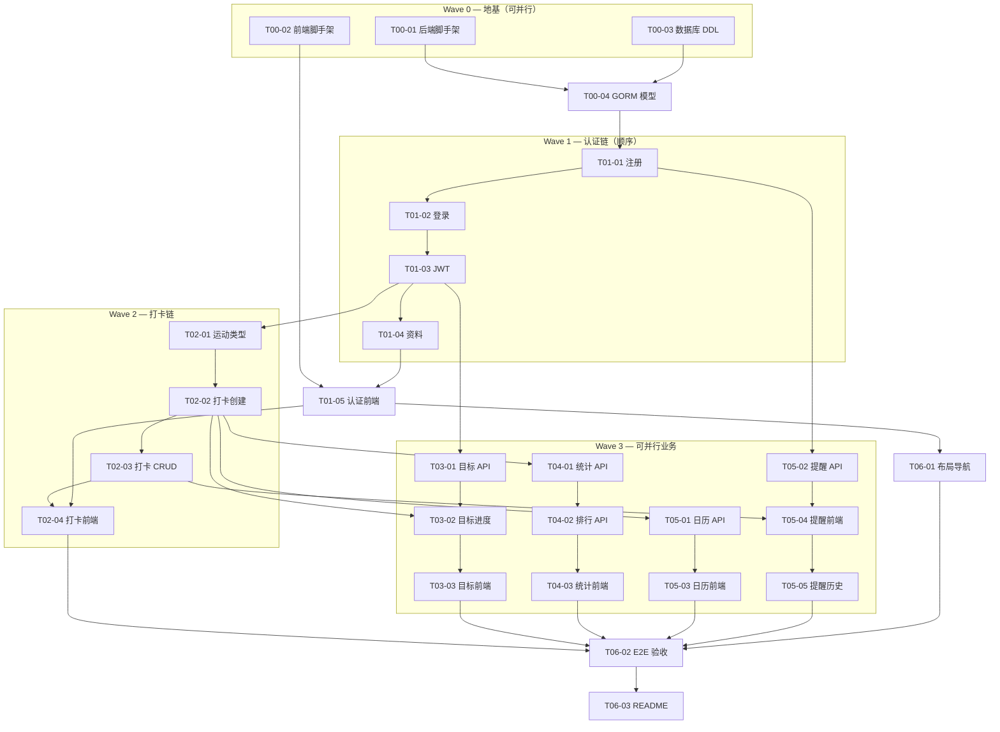

# 运动打卡系统 — 开发顺序指南

> 本文档定义 **27 个细粒度任务**的执行顺序、并行策略、Worktree 分配，以及可直接复制到新会话的 Agent 提示词。

**相关文件：**
- 任务详情：`docs/superpowers/plans/tasks/T*.md`
- 总体计划：`docs/superpowers/plans/2026-07-08-exercise-checkin-system-master-plan.md`
- 设计规范：`docs/design/design-system.md`
- Agent 上下文：`AGENTS.md`

---

## 一、依赖关系总览



---

## 二、Wave 执行顺序

### Wave 0 — 地基（Day 1 上午，3 路并行）

| 顺序 | Task | 分支 | Worktree | 说明 |
|------|------|------|----------|------|
| 0a | **T00-01** | `main` | 无 | 后端入口，阻塞一切后端 |
| 0b | **T00-02** | `feat/T00-02-frontend-scaffold` | `.worktrees/T00-02-frontend/` | 与 0a/0c 并行 |
| 0c | **T00-03** | `main` | 无 | 数据库 DDL，与 0a/0b 并行 |
| 0d | **T00-04** | `main` | 无 | **等待 0a+0c 完成** |

**合并点：** 0b 完成后 merge 到 main；0a+0c+0d 直接在 main。

---

### Wave 1 — 认证链（Day 1 上午~下午，顺序）

| 顺序 | Task | 分支 | Worktree |
|------|------|------|----------|
| 1 | T01-01 注册 API | `feat/T01-01-register` | 无 |
| 2 | T01-02 登录 API | `feat/T01-02-login` | 无 |
| 3 | T01-03 JWT 中间件 | `feat/T01-03-jwt-middleware` | 无 |
| 4 | T01-04 资料 API | `feat/T01-04-profile` | 无 |
| 5 | T01-05 认证前端 | `feat/T01-05-auth-frontend` | `.worktrees/T01-05-auth/` |

**契约冻结点：** T01-04 完成后，M01 全部 API 可用，可开始前端/其他模块。

---

### Wave 1.5 — 布局壳（可与 Wave 2 并行）

| Task | 分支 | Worktree | 依赖 |
|------|------|----------|------|
| **T06-01** 布局导航 | `feat/T06-01-layout` | `.worktrees/T06-01-layout/` | T01-05 |

> 建议 T01-05 完成后立即启动 T06-01，不必等所有页面。

---

### Wave 2 — 打卡链（Day 1 下午，后端顺序 + 前端并行）

| 顺序 | Task | 分支 | Worktree |
|------|------|------|----------|
| 6 | T02-01 运动类型 | `feat/T02-01-sport-types` | 无 |
| 7 | T02-02 打卡创建 | `feat/T02-02-checkin-create` | 无 |
| 8 | T02-03 打卡 CRUD | `feat/T02-03-checkin-crud` | 无 |
| 9 | T02-04 打卡前端 | `feat/T02-04-checkin-frontend` | `.worktrees/T02-04-checkin/` |

---

### Wave 3 — 业务扩展（Day 1 晚 ~ Day 2，4 路并行）

在 **T02-02 完成**（有打卡数据）且 **T01-03 完成**（JWT）后，以下 4 组可并行：

| 并行组 | 任务链 | Worktree 目录 | 负责侧重 |
|--------|--------|---------------|----------|
| **组 A 目标** | T03-01 → T03-02 → T03-03 | `.worktrees/T03-goal/` | 李佳龙 |
| **组 B 统计** | T04-01 → T04-02 → T04-03 | `.worktrees/T04-stats/` | 李佳龙 |
| **组 C 日历** | T05-01 → T05-03 | `.worktrees/T05-03-calendar/` | 丰坤华 |
| **组 D 提醒** | T05-02 → T05-04 → T05-05 | `.worktrees/T05-04-reminder/` | 丰坤华 |

> T05-02 仅依赖 T01-01，可与 Wave 2 后端更早启动。

---

### Wave 4 — 集成验收（Day 2 下午~晚）

| 顺序 | Task | 说明 |
|------|------|------|
| 10 | **全部 merge 到 main** | 解决冲突 |
| 11 | **T06-02** E2E 验收 | 在 main 上执行 |
| 12 | **T06-03** README | 验收通过后 |

---

## 三、Worktree 操作手册

### 3.1 初始化（首次执行一次）

```bash
cd D:\ExerciseRecord

# 确保 git 仓库已初始化
git init

# 将 worktree 目录加入 gitignore
echo ".worktrees/" >> .gitignore
git add .gitignore && git commit -m "chore: ignore worktrees directory"
```

### 3.2 创建 Worktree 模板

```bash
# 通用模板 — 将 <TASK_ID> 和 <BRANCH> 替换为实际值
git worktree add .worktrees/<TASK_ID> -b <BRANCH>
cd .worktrees/<TASK_ID>

# 示例：T00-02 前端脚手架
git worktree add .worktrees/T00-02-frontend -b feat/T00-02-frontend-scaffold

# 示例：T02-04 打卡前端
git worktree add .worktrees/T02-04-checkin -b feat/T02-04-checkin-frontend
```

### 3.3 合并回 main

```bash
cd D:\ExerciseRecord   # 主 worktree
git checkout main
git merge feat/<branch-name> --no-ff -m "merge: <TASK_ID> description"
git worktree remove .worktrees/<TASK_ID>
git branch -d <BRANCH>   # 可选，合并后删除
```

### 3.4 并行 Worktree 一览

| Worktree 路径 | 分支 | 任务 |
|---------------|------|------|
| `.worktrees/T00-02-frontend/` | `feat/T00-02-frontend-scaffold` | T00-02 |
| `.worktrees/T01-05-auth/` | `feat/T01-05-auth-frontend` | T01-05 |
| `.worktrees/T06-01-layout/` | `feat/T06-01-layout` | T06-01 |
| `.worktrees/T02-04-checkin/` | `feat/T02-04-checkin-frontend` | T02-04 |
| `.worktrees/T03-goal/` | `feat/T03-01-goal` → 后续在同事分支 | T03-xx |
| `.worktrees/T04-stats/` | `feat/T04-01-stats` | T04-xx |
| `.worktrees/T05-03-calendar/` | `feat/T05-03-calendar-frontend` | T05-01,05-03 |
| `.worktrees/T05-04-reminder/` | `feat/T05-04-reminder-frontend` | T05-02,04,05 |

---

## 四、任务索引表

| Task ID | 文件 | Wave | 并行组 | 依赖 |
|---------|------|------|--------|------|
| T00-01 | tasks/T00-01-backend-scaffold.md | 0 | P0-后端 | — |
| T00-02 | tasks/T00-02-frontend-heroui-scaffold.md | 0 | P0-前端 | — |
| T00-03 | tasks/T00-03-database-schema.md | 0 | P0-DB | — |
| T00-04 | tasks/T00-04-gorm-models.md | 0 | — | T00-01,03 |
| T01-01 | tasks/T01-01-user-register-api.md | 1 | — | T00-04 |
| T01-02 | tasks/T01-02-user-login-api.md | 1 | — | T01-01 |
| T01-03 | tasks/T01-03-jwt-middleware.md | 1 | — | T01-02 |
| T01-04 | tasks/T01-04-user-profile-api.md | 1 | — | T01-03 |
| T01-05 | tasks/T01-05-auth-frontend.md | 1 | — | T00-02,01-04 |
| T02-01 | tasks/T02-01-sport-types-api.md | 2 | — | T01-03 |
| T02-02 | tasks/T02-02-checkin-create-api.md | 2 | — | T02-01 |
| T02-03 | tasks/T02-03-checkin-crud-api.md | 2 | — | T02-02 |
| T02-04 | tasks/T02-04-checkin-frontend.md | 2 | — | T02-03,01-05 |
| T03-01 | tasks/T03-01-goal-api.md | 3 | A | T01-03 |
| T03-02 | tasks/T03-02-goal-progress-api.md | 3 | A | T03-01,02-02 |
| T03-03 | tasks/T03-03-goal-frontend.md | 3 | A | T03-02 |
| T04-01 | tasks/T04-01-stats-personal-api.md | 3 | B | T02-02 |
| T04-02 | tasks/T04-02-ranking-api.md | 3 | B | T04-01 |
| T04-03 | tasks/T04-03-stats-frontend.md | 3 | B | T04-02 |
| T05-01 | tasks/T05-01-calendar-api.md | 3 | C | T02-02 |
| T05-02 | tasks/T05-02-reminder-api.md | 3 | D | T01-01 |
| T05-03 | tasks/T05-03-calendar-frontend.md | 3 | C | T05-01 |
| T05-04 | tasks/T05-04-reminder-frontend.md | 3 | D | T05-02,02-03 |
| T05-05 | tasks/T05-05-reminder-history-frontend.md | 3 | D | T05-04 |
| T06-01 | tasks/T06-01-app-layout.md | 1.5 | — | T01-05 |
| T06-02 | tasks/T06-02-e2e-acceptance.md | 4 | — | 全部 |
| T06-03 | tasks/T06-03-readme.md | 4 | — | T06-02 |

---

## 五、Agent 提示词模板

### 通用模板

```
请执行运动打卡系统开发任务。

【必读】
1. 打开并完整阅读 AGENTS.md
2. 打开并完整阅读任务文件：docs/superpowers/plans/tasks/<TASK_FILE>.md
3. 前端任务额外阅读：docs/design/design-system.md

【执行要求】
- 严格按任务文件的实现步骤执行
- 遵循任务文件中的功能设计与实现方式
- 完成后逐项对照「测试与验收标准」自检
- 汇报：变更文件列表、验证命令及输出、未解决的阻塞项
- 不要提交 git commit，除非我明确要求

【Worktree】（如适用）
- 在 .worktrees/<ID>/ 目录开发，分支 <BRANCH>
- 如需创建：git worktree add .worktrees/<ID> -b <BRANCH>

开始执行。
```

---

## 六、各任务专用提示词（可直接复制）

### Wave 0

**T00-01 后端脚手架**
```
请执行运动打卡系统开发任务 T00-01。

阅读 AGENTS.md 和 docs/superpowers/plans/tasks/T00-01-backend-scaffold.md，在 main 分支初始化 Go 后端：Gin + viper + /health 端点。完成后用 curl 验证，汇报变更文件。不要 commit。
```

**T00-02 前端脚手架**
```
请执行运动打卡系统开发任务 T00-02。

阅读 AGENTS.md、docs/design/design-system.md 和 docs/superpowers/plans/tasks/T00-02-frontend-heroui-scaffold.md。

在 worktree .worktrees/T00-02-frontend/ 分支 feat/T00-02-frontend-scaffold 上：创建 Vite React TS 项目，集成 HeroUI v3 + Tailwind v4，引入 design-tokens.css 和 Google Fonts（Syne/DM Sans/JetBrains Mono），配置 /api 代理。验证 HeroUI Button 和设计背景色 #F4F7FB。不要 commit。
```

**T00-03 数据库**
```
请执行运动打卡系统开发任务 T00-03。

阅读 AGENTS.md 和 docs/superpowers/plans/tasks/T00-03-database-schema.md，以及 docs/ 下的数据库设计文档。

在 main 分支创建 database/schema.sql（6表）和 seed.sql（6运动类型），编写 backend/.env.example。在本地 MySQL 执行建库建表并验证。不要 commit。
```

**T00-04 GORM 模型**
```
请执行运动打卡系统开发任务 T00-04。

前置：T00-01 和 T00-03 已完成。

阅读任务文件 docs/superpowers/plans/tasks/T00-04-gorm-models.md，在 main 分支实现 6 个 GORM 模型和 MySQL 连接。启动验证 DB connected。不要 commit。
```

### Wave 1

**T01-01 注册 API**
```
请执行 T01-01。阅读 AGENTS.md 和 docs/superpowers/plans/tasks/T01-01-user-register-api.md。
TDD 实现 POST /api/auth/register（username only，bcrypt，默认 reminder_settings）。运行 go test 验证。不要 commit。
```

**T01-02 登录 API**
```
请执行 T01-02。阅读 docs/superpowers/plans/tasks/T01-02-user-login-api.md。
实现 POST /api/auth/login + JWT 签发（7天）。验证正确/错误密码。不要 commit。
```

**T01-03 JWT 中间件**
```
请执行 T01-03。阅读 docs/superpowers/plans/tasks/T01-03-jwt-middleware.md。
实现 AuthMiddleware，Bearer Token 解析，user_id 注入 Context。不要 commit。
```

**T01-04 资料 API**
```
请执行 T01-04。阅读 docs/superpowers/plans/tasks/T01-04-user-profile-api.md。
实现 GET/PUT /api/user/profile 和 PUT /api/user/password。不要 commit。
```

**T01-05 认证前端**
```
请执行 T01-05。阅读 AGENTS.md、docs/design/design-system.md 和 docs/superpowers/plans/tasks/T01-05-auth-frontend.md。

在 .worktrees/T01-05-auth/ 开发。实现登录/注册/资料页，遵循 Dawn Track 设计规范，注册无 email 字段，登录页使用 LaneStripe。手动验证完整流程。不要 commit。
```

### Wave 1.5

**T06-01 布局导航**
```
请执行 T06-01。阅读 docs/design/design-system.md 和 docs/superpowers/plans/tasks/T06-01-app-layout.md。

在 .worktrees/T06-01-layout/ 实现 AppLayout + 路由表 + 侧栏导航（打卡/目标/统计/排行/日历/设置）。仪表盘跑道布局。不要 commit。
```

### Wave 2

**T02-01 ~ T02-03（后端顺序）**
```
请执行 <T02-0X>。阅读 AGENTS.md 和 docs/superpowers/plans/tasks/<对应文件>.md。
按任务实现 API，遵循统一响应格式和错误码。运行测试验证。不要 commit。
```

**T02-04 打卡前端**
```
请执行 T02-04。阅读 docs/design/design-system.md 和 docs/superpowers/plans/tasks/T02-04-checkin-frontend.md。

在 .worktrees/T02-04-checkin/ 实现打卡表单+列表+Modal 编辑删除。运动类型色标、补卡标签、409 错误提示。不要 commit。
```

### Wave 3（并行）

**T03 目标（组 A）**
```
请执行 T03-0X。阅读 docs/superpowers/plans/tasks/<对应文件>.md。
在 .worktrees/T03-goal/ 开发。目标 API/进度/前端，Progress 组件遵循设计规范。不要 commit。
```

**T04 统计（组 B）**
```
请执行 T04-0X。阅读 docs/superpowers/plans/tasks/<对应文件>.md。
在 .worktrees/T04-stats/ 开发。统计聚合 API + Recharts 图表 + 排行 Table。数字用 JetBrains Mono。不要 commit。
```

**T05 日历（组 C）**
```
请执行 T05-01 或 T05-03。阅读 docs/design/design-system.md 和对应任务文件。
在 .worktrees/T05-03-calendar/ 开发。日历 API 含 heat_level；前端 5 级热力图 + Streak + LaneStripe + 图例。不要 commit。
```

**T05 提醒（组 D）**
```
请执行 T05-02/04/05。阅读对应任务文件。
在 .worktrees/T05-04-reminder/ 开发。提醒设置+浏览器通知+智能跳过+历史日志 UI。不要 commit。
```

### Wave 4

**T06-02 E2E 验收**
```
请执行 T06-02。阅读 docs/superpowers/plans/tasks/T06-02-e2e-acceptance.md。

在 main 分支（所有功能已合并）执行 9 条 E2E 流程验收。记录结果到 docs/qa-acceptance.md，修复 BLOCKER 级 BUG。不要 commit。
```

**T06-03 README**
```
请执行 T06-03。阅读 docs/superpowers/plans/tasks/T06-03-readme.md。
编写根目录 README.md：本地 MySQL 配置、前后端启动步骤、测试账号。引用 AGENTS.md。不要 commit。
```

---

## 七、推荐日程（2 天）

| 时段 | 任务 | 人力 |
|------|------|------|
| D1 上午 | Wave 0 全部 | 全员并行 |
| D1 上午~下午 | Wave 1（T01-01~04） | 后端主线程 |
| D1 下午 | T01-05 + T06-01 启动 | 前端 |
| D1 下午 | Wave 2 后端 T02-01~03 | 后端 |
| D1 晚 | T02-04 + Wave 3 四组并行 | 全员 |
| D2 上午 | Wave 3 收尾 | 全员 |
| D2 下午 | merge + T06-02 | 全员 |
| D2 晚 | T06-03 + 交付 | 全员 |

---

## 八、风险与缓解

| 风险 | 缓解 |
|------|------|
| Worktree 合并冲突 | Wave 0 尽快合并；前端按 pages/ 子目录分工 |
| API 契约不一致 | Wave 1 结束后冻结 M01 契约；后端先出 Postman Collection |
| 并行前端缺布局 | T06-01 提前到 Wave 1.5 |
| HeroUI 组件 API 变化 | 以 heroui.com 文档为准，任务中注明 v3 |

---

*文档版本：2026-07-09 | 共 27 个任务*
